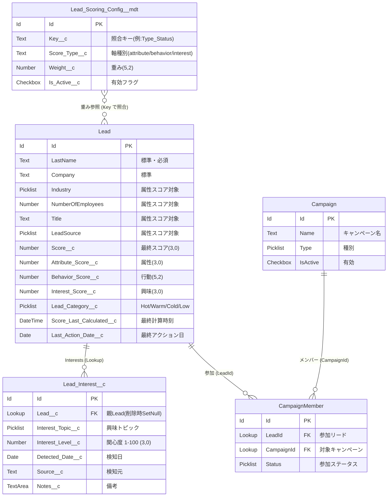
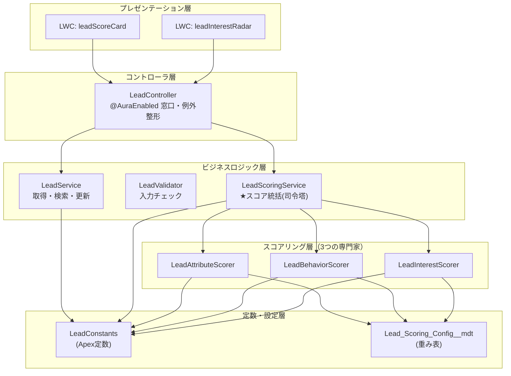
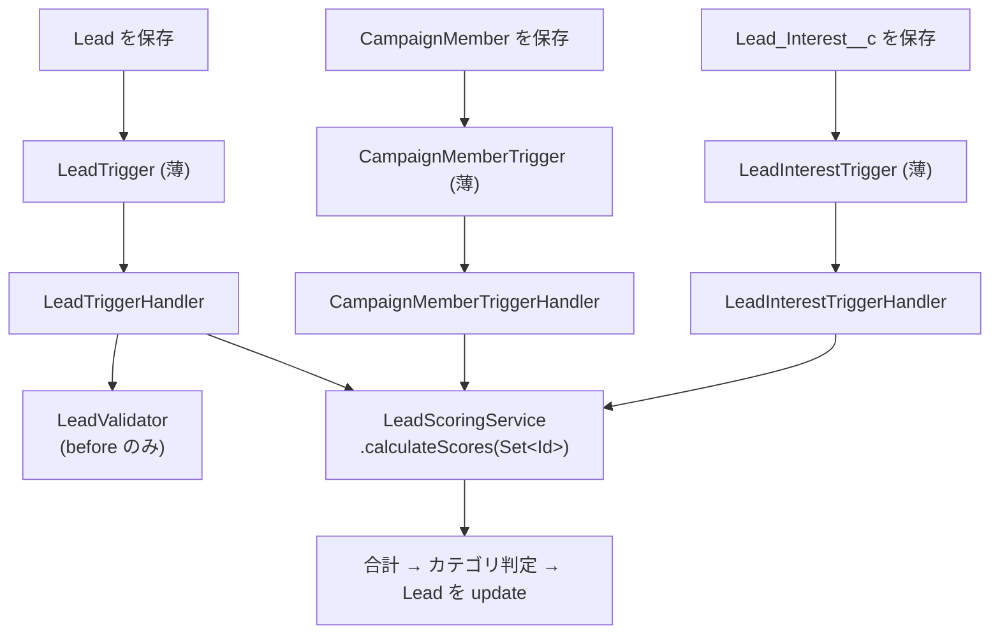
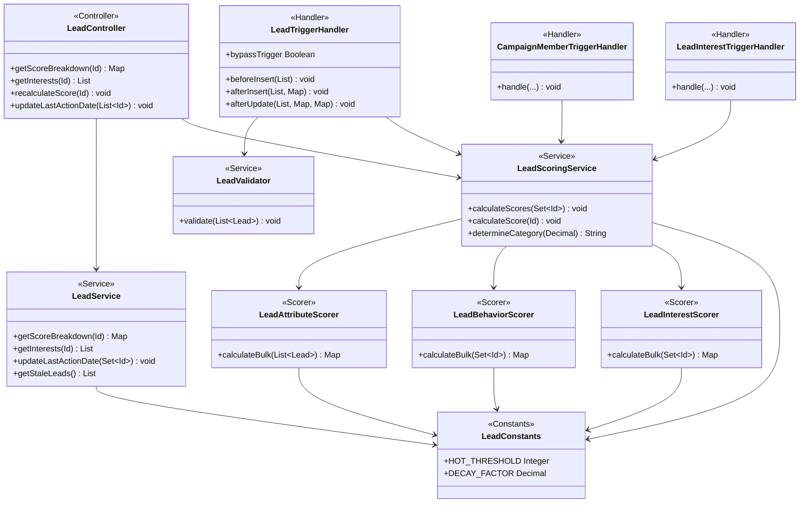
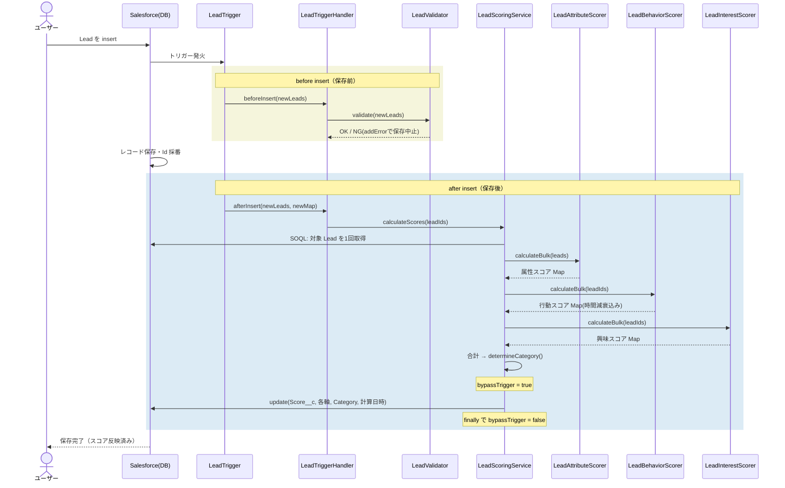
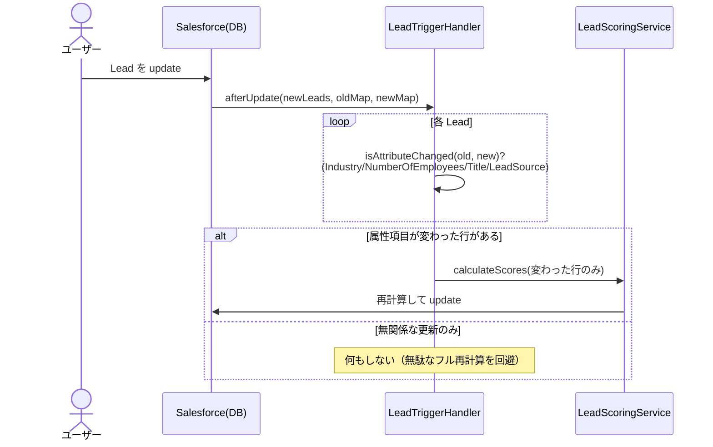
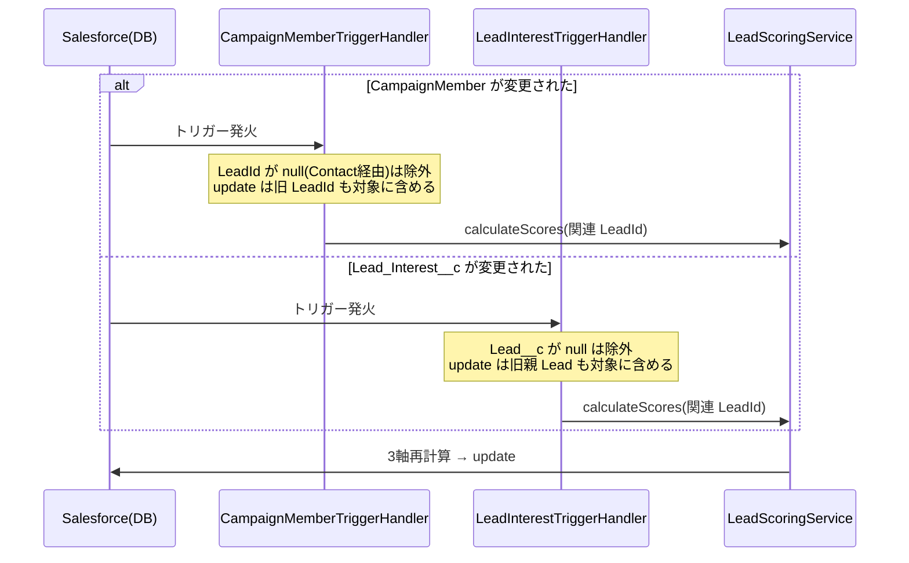
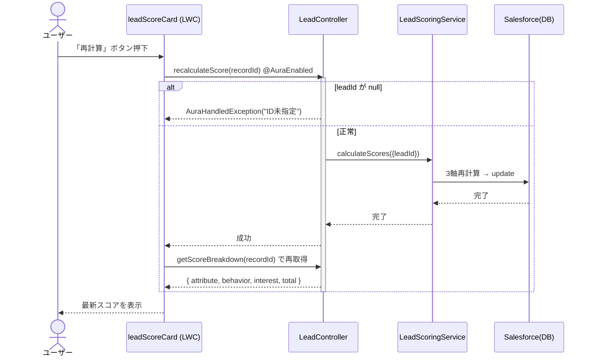
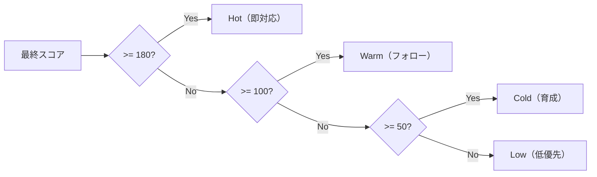

# 設計書 — リード管理・スコアリングシステム（図解）

> 対象読者: 受講者・レビュアー・新規参画メンバー
> このドキュメントは ER図 / クラス図 / シーケンス図 / 全体構成図を **Mermaid 記法** で記載しています。
> GitHub・VS Code（Markdown Preview Mermaid Support 等の拡張）でそのまま図として表示され、
> PDF / PNG への書き出しも可能です。
>
> 文章中心の解説は `architecture-overview.md` / `class-by-class-guide.md` を参照してください。
> 本書は「図で全体像をつかむ」ことに特化しています。

---

## 0. 配布・閲覧について

| 環境 | 図の表示 | 備考 |
|---|---|---|
| GitHub（ブラウザ） | ✅ そのまま表示 | リポジトリ上で `.md` を開くだけ |
| VS Code | ✅ プレビューで表示 | 拡張「Markdown Preview Mermaid Support」推奨 |
| PDF / PNG 書き出し | ✅ 可能 | VS Code 拡張「Markdown PDF」、または Mermaid CLI（`mmdc`） |
| メール / Slack 添付 | △ | テキストのままだと図にならない。PDF 化して配布を推奨 |

> **PDF 化の例（Mermaid CLI）**:
> `npx @mermaid-js/mermaid-cli -i docs/design-diagrams.md -o design-diagrams.pdf`

---

## 1. システム概要

リード（見込み客）を **属性・行動・興味** の 3 軸で自動採点し、
スコア順に優先度（Hot/Warm/Cold/Low）を可視化するシステム。

```
最終スコア = 属性スコア(最大100) + 行動スコア(最大120) + 興味スコア(最大80) = 最大300点

  180点以上 → Hot   (即対応)
  100〜179  → Warm  (フォロー)
   50〜 99  → Cold  (育成)
    0〜 49  → Low   (低優先)
```

| 軸 | データソース | 種類 | 計算クラス |
|---|---|---|---|
| 属性 | Lead レコード自身 | 標準 | `LeadAttributeScorer` |
| 行動 | CampaignMember | 標準 | `LeadBehaviorScorer` |
| 興味 | Lead_Interest__c | カスタム | `LeadInterestScorer` |

---

## 2. ER図（データモデル）

各オブジェクトの主要項目とリレーションを示します。
`PK` = 主キー、`FK` = 外部キー（参照関係）。



> **設計メモ — `Lead_Interest__c.Lead__c` が Lookup である理由**:
> 仕様上は主従関係（Master-Detail）が自然ですが、Lead は主従のマスターになれず、
> 必須 Lookup も削除制約の都合で不可のため、**任意 Lookup（削除時 SetNull）** で実装しています。
> 「親 Lead 必須」の制約はアプリ層（バリデーション）で担保する想定です。

> **`Lead_Scoring_Config__mdt` について**:
> カスタムメタデータ型はリレーションでつながるのではなく、各 Scorer が `Key__c` を
> キーに `Map` 化して照合します（点線で表現）。重みを変えたいときは Apex を変更せず
> このレコードを編集するだけで済みます。

---

## 3. 全体構成図（レイヤーアーキテクチャ）

呼び出しは **上の層から下の層への一方向**。逆流（下位→上位）はありません。



### トリガー発火マップ（イベント駆動の入口）

3 つのトリガーは「薄いトリガー → 専用 Handler → `LeadScoringService`」で統一されています。



---

## 4. クラス図（責務と依存関係）

主要メソッドと依存方向を UML クラス図で表します。



> 3 つの Scorer は互いを知りません（独立）。`LeadScoringService` だけが 3 つをまとめます。
> これは「同じ採点という仕事を別アルゴリズムで行う」**Strategy パターン** に近い構成です。

---

## 5. シーケンス図

### 5-1. リード作成 → スコア確定（基本フロー）

新規 Lead を 1 件保存したときの処理を時系列で示します。



> **再帰防止の肝**: ⑤ の update が再び Lead トリガーを発火させると無限ループになります。
> そのため `bypassTrigger = true` にして再発火を抑止し、`finally` で必ず `false` に戻します。

### 5-2. スコア更新時の賢い分岐（after update）

更新時は **属性に影響する項目が変わった行だけ** 再計算します。



### 5-3. 別の軸が動いたとき（行動 / 興味トリガー）

キャンペーン参加や興味レコードが変わると、別トリガーから同じ `calculateScores()` に合流します。



### 5-4. 画面からの再計算ボタン（LWC → Controller）



> Controller は内部例外をそのまま返さず、`AuraHandledException` でユーザー向けの
> 安全なメッセージに整形します。状態変更メソッドは `cacheable=false`、
> 読み取りメソッド（`getScoreBreakdown`/`getInterests`）は `cacheable=true` です。

---

## 6. スコア計算ロジック（補足図）

### 行動スコアの時間減衰

```
減衰係数 = 0.95 ^ 経過日数

  当日:   1.00 (100%)
  7日前:  0.70 ( 70%)
  14日前: 0.49 ( 49%)
  30日前: 0.21 ( 21%)
```

### カテゴリ判定フロー



---

## 7. 関連ドキュメント

| ドキュメント | 内容 |
|---|---|
| `architecture-overview.md` | プロジェクト全体マップ（文章＋ASCII図） |
| `class-by-class-guide.md` | クラス別の詳細解説 |
| `design-diagrams.md` | 本書（ER図・クラス図・シーケンス図・全体構成図） |
| `CLAUDE.md` | プロジェクトルール・コーディング規約 |

---

最終更新: 2026年6月
